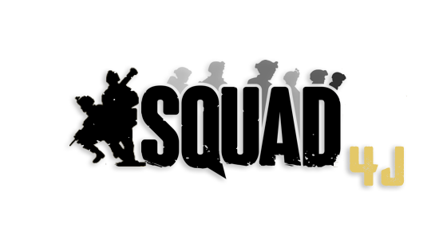
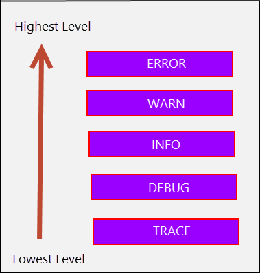

<div align="center">


<h1>Squad4J</h1>

<a href="https://github.com/roengle/Squad4J/releases"></a>
<a href="https://github.com/roengle/Squad4J/graphs/contributors"></a>
<a href="https://github.com/roengle/Squad4J/blob/development/LICENSE.md"></a>

<br>
<a href="https://github.com/roengle/Squad4J/issues"></a>
<a href=""></a>
<a href="https://discord.gg/DjrpPuw"></a>

</div>

## About

Squad4J is **currently in development** and is **actively seeking contributors**! To contribute, join the [Squad RCON](https://discord.gg/DjrpPuw)
discord and post in one of the Squad4J channels.

Squad4J is a plugin framework written in Java designed to run alongside Squad servers. It draws inspiration 
from [SquadJS](https://github.com/Team-Silver-Sphere/SquadJS), which was the first framework to successfully
parse Squad log files to express the state of a server and its players in code.

Since Squad4J is in *development* a lot of sections of this README and code as a whole are **unfinished**.

## Using Squad4J

Squad4J currently only supports reading log files locally, so it must be run on the same server as your Squad server.

Squad4J requires access to the following for your server:
- Ability to read `SquadGame.log` file, usually located in `SquadGame/Saved/Logs`.
- Ability to connect to RCON running on your server (default TCP port 21114).
  - **If** you have multiple RCON connections to your server, ensure that `MaxConnections` in `Rcon.cfg` is set high enough to accommodate all connections. By default, Squad servers allow 5 simultaneous connections.
- Ability to query server (default UDP 27165).

If you utilize a firewall, ensure it opens ports to where Squad4J is running.
### Prerequisites

- Java 11 (or higher) runtime installed.

### Base Installation
This section is WIP.

### Building Yourself (Required if you write plugins or make changes to Squad4J)
#### Additional Prerequisites
- Maven - Must be able to use Maven through the command-line with the `mvn` command or through your IDE.

## Configuring Squad4J
Squad4J is configured via a JSON file called `config.json`. In a development environment, this is found in 
`src/main/resources/`, but in production it can exist in the same directory as the compiled jar file.

<details>
  <summary>Server</summary>
  <h3>Server Configuration</h3>
  <p>The <code>server</code> configuration defines information about the Squad server.</p>
<pre>
<code>"server": {
  "id": 1,
  "host": "",
  "queryPort": 27165,
  "rconPort": 21114,
  "rconPassword": "",
  "logFilePath":"",
  "adminLists": [
    {
      "type": "remote",
      "source": "http://yourwebsite.com/Admins.cfg"
    },
    {
      "type": "local",
      "source": "/home/squadserver/SquadGame/ServerConfig/Admins.cfg"
    }
  ]
}</code>
</pre>
  <ul>
    <li><code>id</code> - Unique integer to identify your server.</li>
    <li><code>host</code> - The IP address of your server.</li>
    <li><code>queryPort</code> - The query port that your Squad server listens on. Default is <code>27165</code>.</li>
    <li><code>rconPort</code> - The RCON port your Squad RCON server listens on. Default is <code>21114</code>.</li>
    <li><code>rconPassword</code> - The RCON password for your Squad server.</li>
    <li><code>logFilePath</code> - The <b>absolute path</b> of the <code>SquadGame.log</code> file. For example: 
      <code>C:/servers/squad/SquadGame/Saved/Logs/SquadGame.log</code> or <code>/home/squadserver/SquadGame/Saved/Logs/SquadGame.log</code>.</li>
    <li><code>adminLists</code> - An array of admin lists. These should only include actual admins for the server. Each object in the array should contain:</li>
      <ul>
        <li><code>type</code> - Either <code>remote</code> or <code>local</code>.</li>
        <li><code>source</code> - A file path if <code>type</code> is set to <code>local</code>, or a web URL to a remote list if 
          <code>type</code> is set to <code>remove</code>.</li>
      </ul>
  </ul>
  
</details>

<details>
  <summary>Logging</summary>
  <h3>Logging Configuration</h3>
  <p>The <code>logging</code> section defines properties for the logging outputted to the console.</p>
  <h6>Default Configuration</h6>
<pre>
<code>"logging": {
  "level": "info",
  "colors": {
    "trace": {
      "bold": false,
      "color": "default"
    },
    "debug": {
      "bold": true,
      "color": "green"
    },
    "info":{
      "bold": true,
      "color": "blue"
    },
    "warn": {
      "bold": true,
      "color": "yellow"
    },
    "error": {
      "bold": true,
      "color": "red"
    }
  }
}</code>
</pre>
  <h4>Options</h4>
  <ul>
  <li>
    <h4>level</h4>
    <h6>Description</h6>
    <p>The minimum logging level to output to the console. Any levels <b>above</b> or <b>equal</b> this level will be outputted to the console, and any levels <b>below</b> will not be outputted. See the picture below:</p><br>
    <div style="text-align: center;"></div>
    <p>For example, if level is <code>info</code>, then <code>info</code> and anything above it(<code>warn</code> and <code>error</code>) will be logged to the console. </p>
    <h6>Available Values</h6>
    <p>The following is the available values for <code>level</code>:</p>
    <ul>
      <li><code>error</code> - Only log errors to the console.</li>
      <li><code>warn</code> - Log errors and warnings to the console.</li>
      <li><code>info</code> - <i>Default</i>. Log errors, warnings, and informational messages are sent to the console. This option is the recommended option to use for the <code>level</code> option.</li>
      <li><code>debug</code> - Log errors, warnings, informational messages, and debug messages are sent to the console. This option is good for debugging new and existing plugins.</li>
      <li><code>trace</code> - Log errors, warnings, informational messages, debug messages, and trace messages to the console. This option is <b>NOT RECOMMENDED</b> for use in production.</li>
      <li><code>all</code> - Log <b>everything</b> the console. This option is <b>NOT RECOMMENDED</b> for use in production.</li>
    </ul>
    <h6>Default</h6>
    <code>"level" : "info"</code>
  </li><br>
  <li>
    <h4>colors</h4>
    <p>JSON Object which defines the color scheme used for various logging levels. Has configurations for <code>trace</code>, <code>debug</code>, <code>info</code>, 
      <code>warn</code>, and <code>error</code> levels.</p><br>
    <p>Each level configuration has the following options:</p>
    <ul>
      <li><code>bold</code> - Boolean value for if the text should be bolded. Can either <code>true</code> or <code>false</code>. Ensure that
        the value does not have quotes around it.</li>
      <li><code>color</code> - String value for the color the logging level should display as. Available values are 
        <code>black</code>, <code>blue</code>, <code>cyan</code>, <code>green</code>, <code>magenta</code>, <code>red</code>, 
        <code>white</code>, <code>yellow</code>, or <code>default</code>. If name is invalid, then the <code>default</code> color will be used.</li>
    <h6>Default</h6>
<pre>
<code>"colors": {
  "trace": {
    "bold": false,
    "color": "default"
  },
  "debug": {
    "bold": true,
    "color": "green"
  },
  "info":{
    "bold": true,
    "color": "blue"
  },
  "warn": {
    "bold": true,
    "color": "yellow"
  },
  "error": {
    "bold": true,
    "color": "red"
  }
}</code>
</pre>
    </ul>
  </li>
  </ul>
</details>

## Plugins
Interested in coding your own plugin? See [Creating Your Own Plugins](./src/main/java/plugins/README.md) for more.

The following plugins are built into Squad4J. See below for how to configure them:

<details>
        <summary>ChatCommands</summary>
        <h3>ChatCommands</h3>
        <p>Implementation of ChatCommands from <a href="https://github.com/Team-Silver-Sphere/SquadJS#chatcommands">SquadJS</a>. ChatCommands can be configured to warn the user calling a specified command, or broadcast a message to the whole server based on a whole command.</p>
        <p><b>NOTE:</b> If you configure a command to broadcast to the whole server, it is recommended that the command can only execute from admin chat. To do this, configure the <code>ignoreChats</code> field like such: <code>["ChatAll", "ChatTeam", "ChatSquad"]</code>. This will only allow the command to be executed from <code>ChatAdmin</code>.</p>
        <h4>Options</h4>
        <ul>
        <li>
            <h4>prefix</h4>
            <h6>Description</h6>
            <p>A <b>string</b> which denotes the prefix for all commands. For example commands with names <code>!nextmap</code> and <code>!squad4j</code> should have <code>prefix</code> set to <code>!</code>.</p>
        </li>
        <h6>Default</h6>
        <code>"prefix" : "!"</code>
        <li>
            <h4>commands</h4>
            <h6>Description</h6>
            <p>An <b>array of objects</b> containing the following properties: 
                <ul>
                    <li><code>command</code> - The command that initiates the message.</li>
                    <li><code>type</code> - Either <code>warn</code> or <code>broadcast</code>.</li>
                    <li><code>response</code> - The message to respond with.</li>
                    <li><code>ignoreChats</code> - An array of strings of chat types to ignore. Valid values are <code>ChatAll</code>, <code>ChatTeam</code>, <code>ChatSquad</code>, and <code>ChatAdmin</code>. Other values are simply ignored.</li>
                </ul>
            </p>
            <h6>Default</h6>
        </li>
        <pre>
<code>"options":
[
    {
        "command": "squad4j",
        "type": "warn",
        "response": "This server is running Squad4J.",
        "ignoreChats": []
    }
]</code>
        </pre>
        </ul>
</details>

## Notes from Developer

## Versions & Releases

## Credits

- [SquadJS and Contributors](https://github.com/Team-Silver-Sphere/SquadJS) - The original Squad log parsing and server-side 
scripting framework. Paved the path for a lot of techniques that Squad4J uses to collect server
info and methods to interact with servers and players.

## Dependencies Used

- [org.json](https://mvnrepository.com/artifact/org.json/json/20210307) - Used for parsing JSON data.
- [mysql-connector-java](https://mvnrepository.com/artifact/mysql/mysql-connector-java/8.0.27) - Used for reading/writing to MySQL databases.
- [logback-classic](https://mvnrepository.com/artifact/ch.qos.logback/logback-classic/1.2.11) - Used for logging.
- [slf4j-api](https://mvnrepository.com/artifact/org.slf4j/slf4j-api/1.7.36) - Native implementation with logback.
- [commons-io](https://mvnrepository.com/artifact/commons-io/commons-io/2.11.0) - Library for I/O operations.
- [commons-cli](https://mvnrepository.com/artifact/commons-cli/commons-cli/1.5.0) - Library for CLI operations.
- [json-path](https://mvnrepository.com/artifact/com.jayway.jsonpath/json-path/2.7.0) - Used for providing JSON paths to evaluate config.json.
- [guava](https://mvnrepository.com/artifact/com.google.guava/guava/31.1-jre) - Various operations and collections.

## Built With

- [Maven](https://maven.apache.org/) - Dependency management

## License

```
Boost Software License - Version 1.0 - August 17th, 2003

Copyright (c) Robert Engle 2022

Permission is hereby granted, free of charge, to any person or organization
obtaining a copy of the software and accompanying documentation covered by
this license (the "Software") to use, reproduce, display, distribute,
execute, and transmit the Software, and to prepare derivative works of the
Software, and to permit third-parties to whom the Software is furnished to
do so, all subject to the following:

The copyright notices in the Software and this entire statement, including
the above license grant, this restriction and the following disclaimer,
must be included in all copies of the Software, in whole or in part, and
all derivative works of the Software, unless such copies or derivative
works are solely in the form of machine-executable object code generated by
a source language processor.

THE SOFTWARE IS PROVIDED "AS IS", WITHOUT WARRANTY OF ANY KIND, EXPRESS OR
IMPLIED, INCLUDING BUT NOT LIMITED TO THE WARRANTIES OF MERCHANTABILITY,
FITNESS FOR A PARTICULAR PURPOSE, TITLE AND NON-INFRINGEMENT. IN NO EVENT
SHALL THE COPYRIGHT HOLDERS OR ANYONE DISTRIBUTING THE SOFTWARE BE LIABLE
FOR ANY DAMAGES OR OTHER LIABILITY, WHETHER IN CONTRACT, TORT OR OTHERWISE,
ARISING FROM, OUT OF OR IN CONNECTION WITH THE SOFTWARE OR THE USE OR OTHER
DEALINGS IN THE SOFTWARE.
```